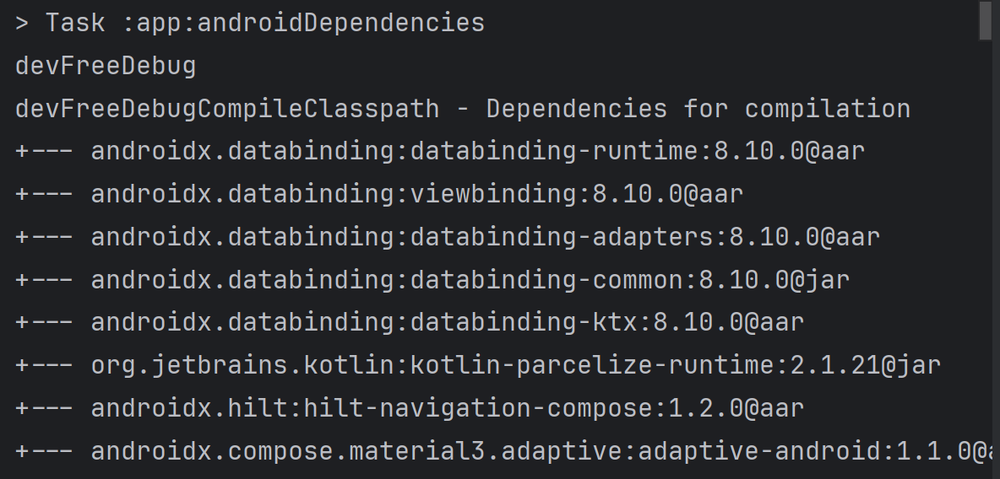
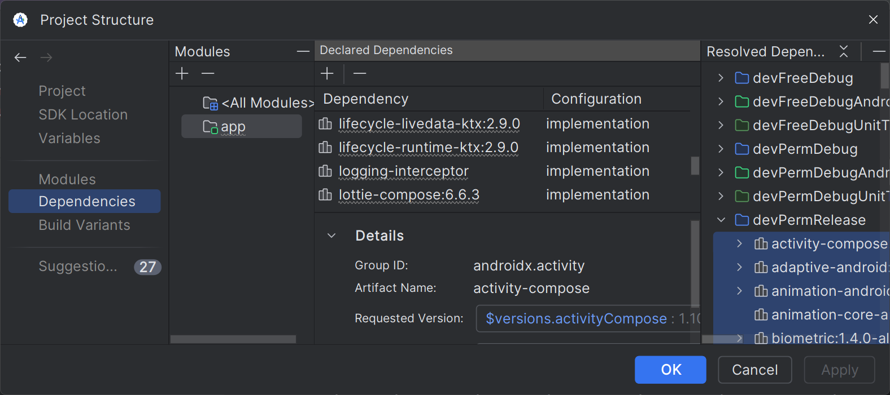
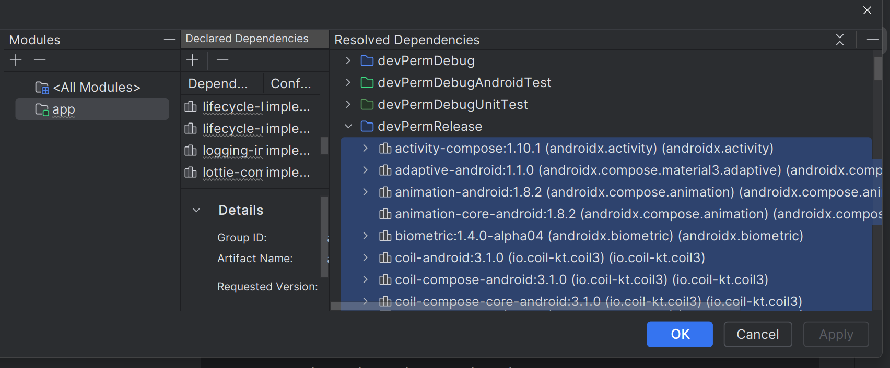
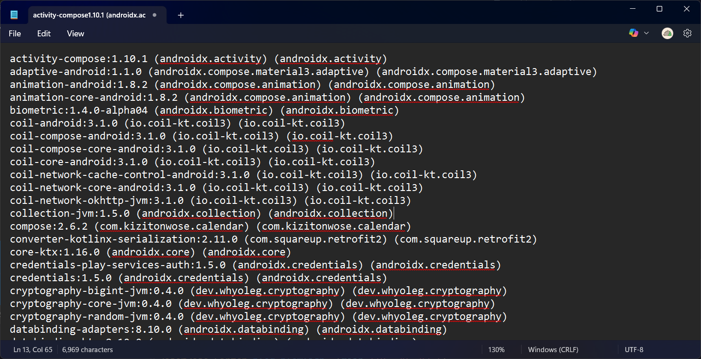

## Introduction

I had the chance to work on an app that required a security test based on OWASP guidelines. Based on the requirement, I was asked to export a list of all the dependencies used in the app in the format `name|version|source`. Since I was using version.toml with Gradle’s Version Catalog, getting everything into that format wasn’t straightforward. At first, I just used an LLM to help with the formatting—but along the way, I discovered a much simpler approach worth sharing.

 As the Gradle Version Catalog has been streamlined, managing and sharing dependencies across submodules has become so much easier, but it is now harder to present those dependencies version in a simple manner those data back for the Mobile Application Security Package Analysis.

But there is actually an easy way to do that, which can be achieve by a few clicks in Android Studio IDE.

### Method 1: From Gradle CLI

You can run `gradle :app:androidDependencies` in Android Studio to get all the compiled dependencies use in the project, this will listed all the dependencies graph under that aar packages with respect to build variants.

### Method 2: From Android Studio

Or it can be get from `File` > `Project Structure` > `Dependencies`

On the right hand side we can see the `Resolved Dependencies` and each build flavors. For example, I will choose `devPermRelease`

<!-- more on build variants here -->

You can see all the resolved dependencies here, you can even highlight all the dependencies in that group and use `Copy Shortcuts` on your Operating System (Right Click doesn't seemed to work here) and then paste it in your favourite text editor.

||
| :-: |
| Example of copied dependencies |

## Key Takeaways

- Learned how to export a list of dependencies from Gradle Version Catalog in a text format, useful for security reports and audits.
- This method also works if you need to export dependencies for a specific build variant or product flavor.